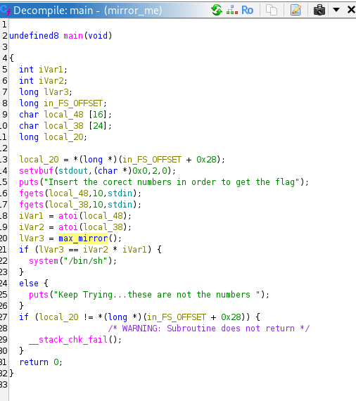
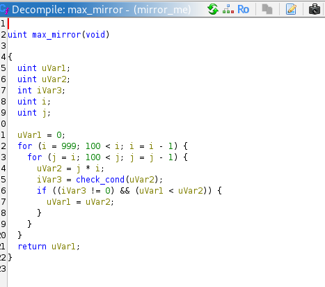
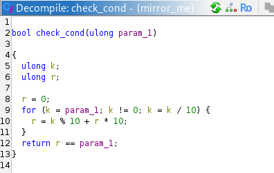
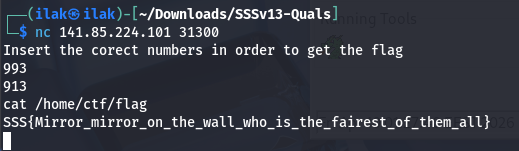

# Binary: Mirror Me
In this binary, we are interested in the main, max_mirror and check_cond functions:

As we are told, we need 2 numbers to get the flag. Strings output also gives us this hint: `find__the__3digits__numbers__whose__product = maximum__mirrored__number`

The numbers required are indicated by the max_mirror function:

i goes from 999 to 101 and j from i to 101. uVar1 is the highest possible uVar 2 (i * j) and check_cond checks if the number is a palindrome (mirrored, as the challenge name) => 993 × 913 = 906609 – is a palindrome, therefore these are the numbers.

