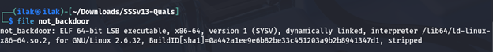
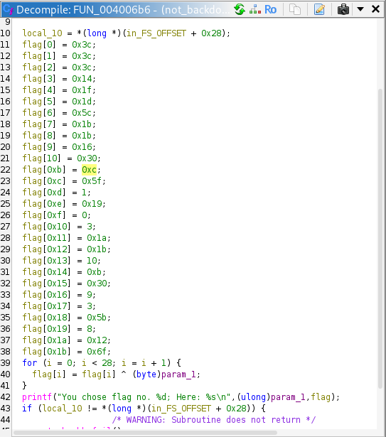
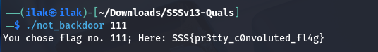

# Binary: Not Backdoor
Initially, given that it says not-backdoor.exe, I thought it was a PE file. I was wrong:

I used 7z to extract the actual ELF and proceeded to further analyze.

We can see the function XORs the flag. Went ahead and used cyberchef to bruteforce the key. It was 0x6f, that is 111: 

