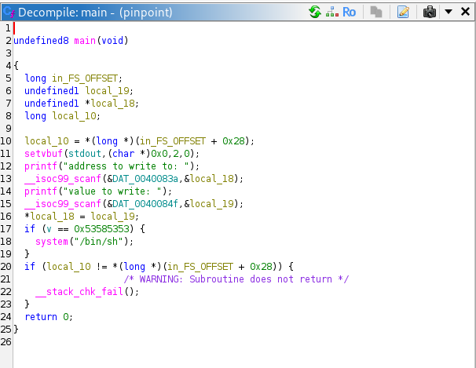
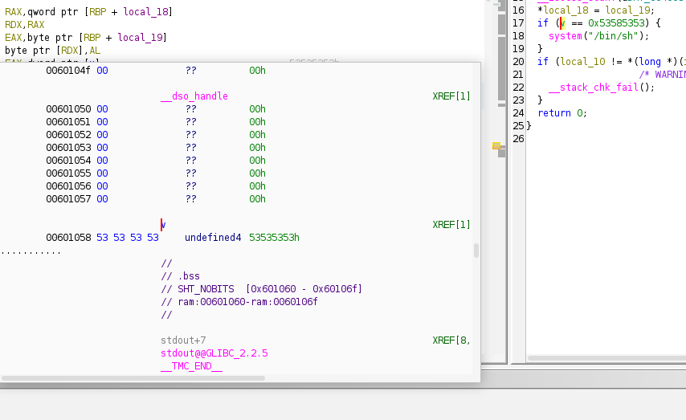
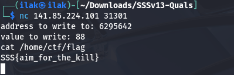

# Binary: Pinpoint

Here, as the text says, we can write something to a certain memory address. Then, it checks if v is 0x53585353. v, however, is defined as the following:

Therefore, we need only change the third 53 to 58 to fulfill condition. The address would be 0x60105A ( 0x601508 + 3 ), but that gives segmentation fault. The address must be written in decimal -> 6295642 and the number 58 -> 88.

