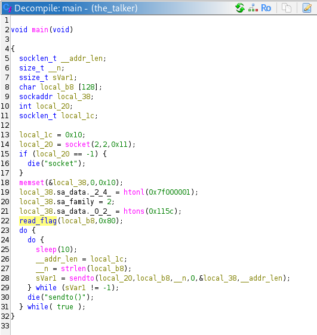
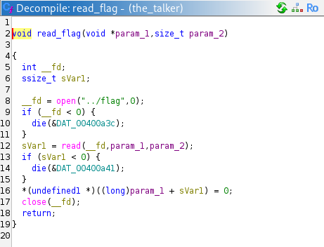
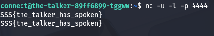

# Binary: The Talker
The main and read_flag functions interests us in order to find out which parameters to give the binary.

The functions opens a UDP session on localhost 4444 and sends the flag every 10 seconds. The solution is to connect to the machine via SSH as instructed in the challenge description and just open a UDP connection on 4444 using netcat.

