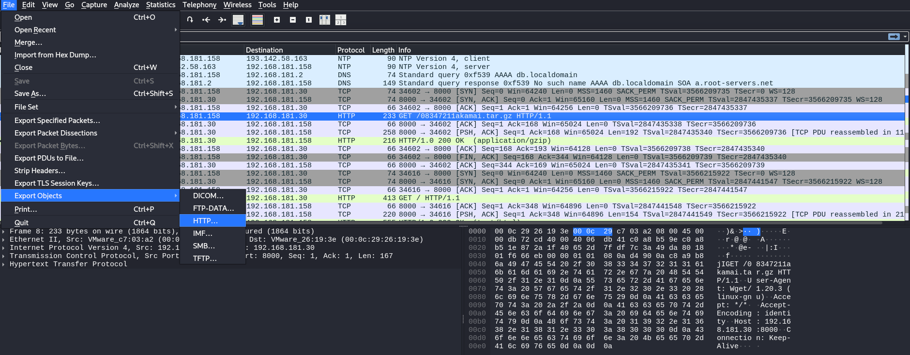

# Forensics: Operation 1337 Niffler
This challenge gives us a packet capture with a few HTTP connexions. We use the export-objects function in Wireshark and find the flag in the file 08347211akamai.tar.gz -> pdf.txt.

Flag: SSS{prind_pachete_pe_retea}
