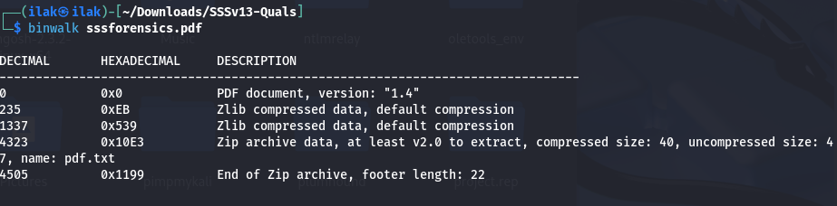

# Forensics: Operation Last Read
PDF says there’s “nothing to see here”. To solve this challenge, we use binwalk to see if there’s any file hidden within the original.

Seeing a .zip file, we use unzip it and find the flag: SSS{poti_sa_te_ascunzi_dar_nu_te_poti_ascunde}
