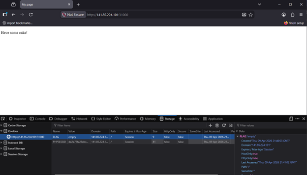
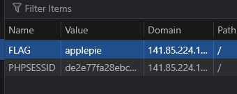

# Web: Cake
Description: Get the flag from Cake.
We all love applepie.

We are presented with a simple text:

Upon inspecting the cookies, we can see a FLAG section. If we all love applepie, might as well try to change it:

This way, we get the flag:

Flag: SSS{hansel_gretel}
