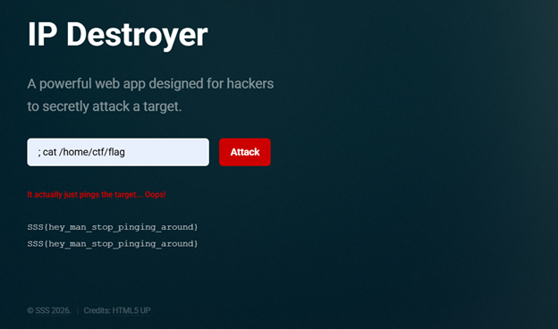

# Web: IP Destroyer

This is a common command injection vulnerability. The input is in the form of ping <input>. If we escape it using “;” , then we can further inject our commands:

Flag: SSS{hey_man_stop_pinging_around}
