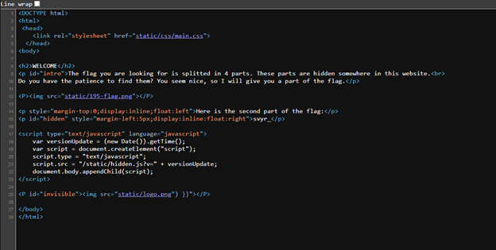
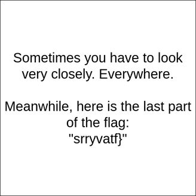

# Web: Welcome
In this challenge, we must combine 4 parts of the flag. View-source is again our best friend. 

The first part is located in /static/css/main.css -> `/* The first part of the flag is: "FFF{rirel_" */`

The second part is already visible in the picture, whereas the third part can be found in the /static/hidden.js -> `/*
JavaScript is pretty cool. It is mainly used in the development of web pages.
You will have to read some JS code in your journey as a hacker.
This one is on us, but maybe you will have to dig deeper in your next
adventure. The third part of the flag is: "unf_".
*/`  

And /static/logo.png completes the puzzle:

Combining these and using ROT13 gives the following flag: SSS{every_file_has_feelings}
